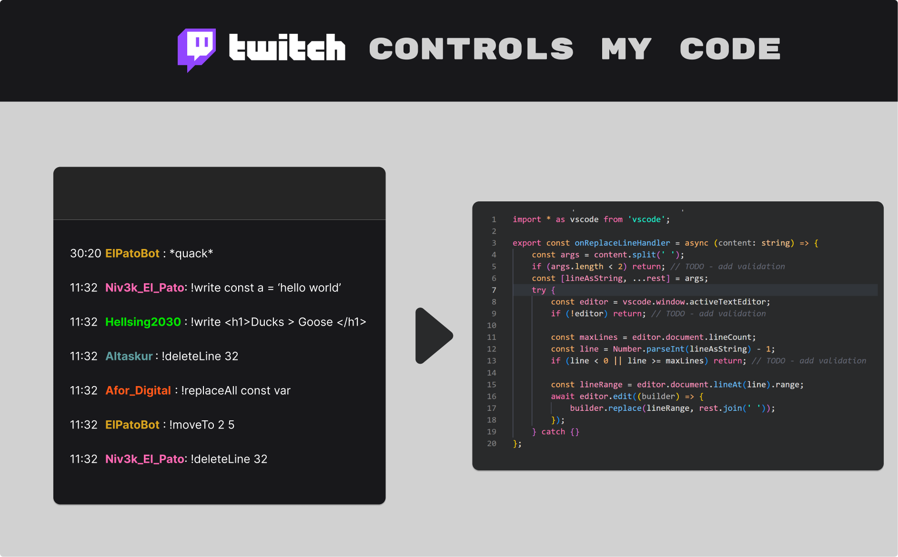

## ⌨️ Installation

1. `CMD + Shift + P` and enter Command `> connect` and type your twitch channel name.

## ❕ Twitch commands
Your viewers will be able to control the opened document by typing the following commands on the chat:
* _Insert text on cursor:_ `!write hello world`
* _Deletes a specific line:_ `!deleteLine 32`
* _Replace all occurences with a word_:_ `!replaceAll const var`